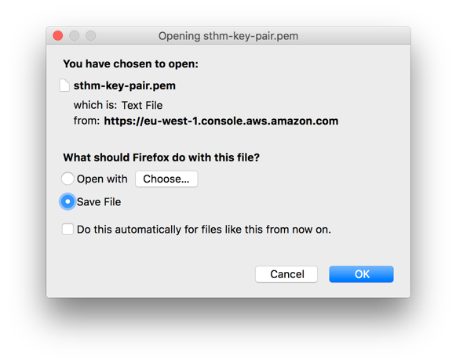
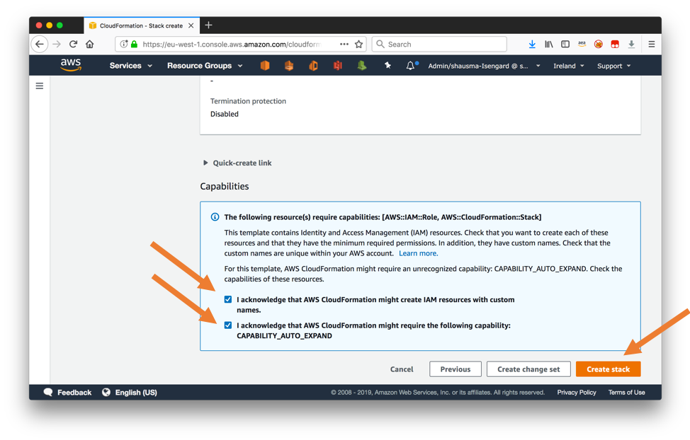
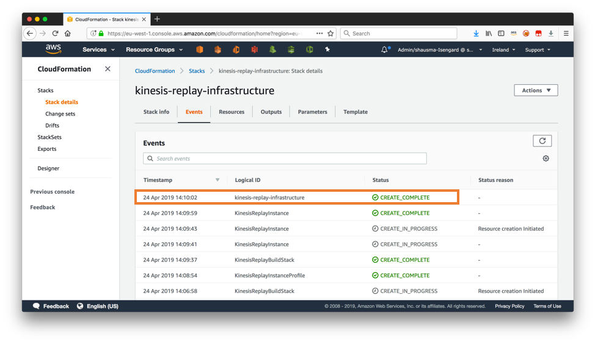

# Lab1 : Stream ingest AWS IOT Core data to Amazon Kinesis Streams

## Section 1: Create an EC2 linux Instance using the cloudformation template

In this section, you will define your personal SSH Key Pair private key so you can login to the EC2 instance we will use in this lab.

### 1.	Navigate to the EC2 service and choose Key Pairs in the navigation bar on the left. 


### 2.	Click Create Key Pair and enter a name for the SSH key pair in the resulting dialog box, eg, initals-key-pair and select Create. 


### 3.	Confirm the download of the generated .pem file to your local machine.



Now that you have successfully created an SSH key pair, you can create the EC2 instance that you will use in lab1 to ingest IOT stream and also in lab2 to ingest taxi trip events into the Kinesis data stream.

## Create an EC2 Instance and Build the taxi trip producer client
In this section, you will use a CloudFormation template to build a producer client program that sends NYC taxi trip data to our Kinesis Data Stream.


### 1.	Right-click on this [link](https://console.aws.amazon.com/cloudformation/home#/stacks/new?stackName=kinesis-replay-infrastructure&templateURL=https://dave-kinesis-lab.s3.amazonaws.com/kinesis-replay-infrastructure.yml) and open it in a new tab to execute a CloudFormation template that uses CodePipeline and CodeBuild to compile the kinesis replay Java application and to provision a EC2 instance. Select Next on the resulting dialog. 


### 2.	On the next page of the dialog, specify an appropriate CIDR range to that is able to connect to the EC2 instance over SSH as the ClientIpAddressRange parameter. Moreover, select the previously created SSH key pair from the SshKeyName dropdown menu.


### 3.	On the next dialog for Step 3, leave all parameters set to their default and select Next. 

### 4.	On the last page of the dialog, confirm that CloudFormation may create IAM resource and create nested CloudFormation stacks by selecting the checkbox "I acknowledge that AWS CloudFormation might create IAM resources" and "I acknowledge that AWS CloudFormation might require the following capability: CAPABILITY_AUTO_EXPAND". Finally select Create stack at the bottom of the page.



### 5.	Wait until the CloudFormation template has been successfully been created. This may take around 5 minutes.



### 6.	Navigate to the Outputs section of the CloudFormation template and take a note of the outputs for KinesisReplayInstance and ProducerCommand.


The CloudFormation template has created and configured an EC2 instance so that we can now start to ingest taxi trip events into the Kinesis data stream.


## Connect to the new EC2 instance and run the producer client program
In this section, you will connect to the new EC2 instance 

### 1.	Connect to the EC2 instance via SSH from your laptop. You can obtain the command including the correct parameters from the Outputs section of the CloudFromation template.  

Note: you will need to edit the "keyname.pem" and point to your downloaded ec2 ssh keypair file (your filename probably will be different than keyname.pem).
Note: you will likely also need to do a "chmod 0400 keyname.pem" on your ssh keypair file to set the right permissions.

Use the command from the Outputs section, but it should look somewhat like this:
```
# DO NOT COPY AND PASTE THIS COMMAND.
# THIS IS JUST AN EXAMPLE
# USE THE OUTPUT FROM YOUR CLOUDFORMATION TEMPLATE.
# YOU WILL NEED TO EDIT THE keyname.pem file/location.
$ chmod 0400 keyname.pem
$ ssh -i keyname.pem -C ec2-user@ec2-34-254-244-45.us-east-1.compute.amazonaws.com
```
 
Note for Windows users: Instead of the above command, you will need to follow these [instructions](https://docs.aws.amazon.com/AWSEC2/latest/UserGuide/putty.html) to use PuTTY to connect to the EC2 instance.

## Section 2: Ingest IOT Core data to Kinesis Streams

1.	From your AWS console, search for AWS IOT Core under services menu. 
   On the left hand side, expand "Manage" --> click "Things" --> create -->   Create a single thing --> name anything like "myIOTTopic". (A thing represents a device that will send the data to IOT for processing and storage)
    
    Alternatively, you an run the following AWS CLI command and go tp step 3.
    `aws iot create-thing --thing-name myIoTTopic`

3.	
  If you used AWS CLI command to create a "thing", then find the certificates in the screenshot below. Otherwise, skip the following screenshot and move on to selecting the certificate. 
  
  
 
  Click create certificate as seen in screenshot below.
  
  
 
  Download all the files and click activate as seen in screenshot below
  
  

   Don't miss the 4th cert CA root cert at the bottom of the page and download the cert named "Amazon Root CA 1"

•	Create IoT Core policy
o	Navigate to Secure --> Policies on the left hand pane and click create apolicy. Enter any name and add 2 actions as follows and click create. To create a second section, click Add Statement button

 

 
•	Attach policy to certificate
o	Navigate to Secure--> certificates pane on IOT core landing page, click on the certificate you created previously. In the top right corner, click on the menu represnted by ... and select attach policy. Select the policy you just created and click attach.
 

 

•	Attach certificate to thing
Navigate back to the certificates page, select the certificate you created previously. From the same menu represented by ... , select Attach thing. Select the thing you created previously.
 


4.	Configure device
•	Copy all the certificate files you downloaded previously to a folder from where you will run the simulator that generates random data and sends it to the topic
•	Copy the simulator script to the same folder.
•	Make sure you can access the IOT endpoint from here


5.	Configure and test rules
•	Navigate to Act->Rules and click create
 

•	Enter the name of the rule and update the query to reflect the topic you will be sending data to.
 

•	Navigate down and select Add action. In the next screen, select “Send a message to an Amazon Kinesis Stream” and click configure action
 


 
•	On the next screen, Select create a new resource for the stream. This will take you to Create a data stream screen.
 

 
•	Click on create data stream and enter the stream name, add the number of shards needed for the use case and click create data stream:

 

 
•	Once the stream is created, go back to the Configure Action page and hit refresh next to Stream Name. You will now see the new stream you just created. Enter the partition key and click on create role.
 
 

•	Enter the role name and click create role:
 


•	Next, click on Add action and you are done with adding a new action to the IOT rule. Now, you are back on Create Rule page. Scroll down and hit Create Rule button. You now have a rule configured to send data to Kinesis Stream. 

6.	Run the simulator script to generate random data to send to AWS IOT Engine.

