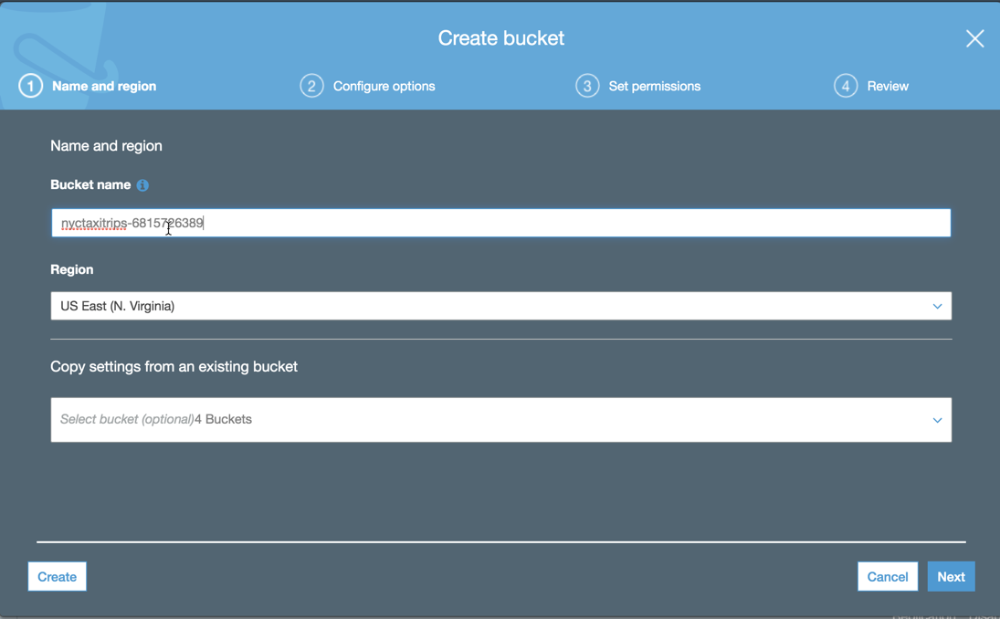
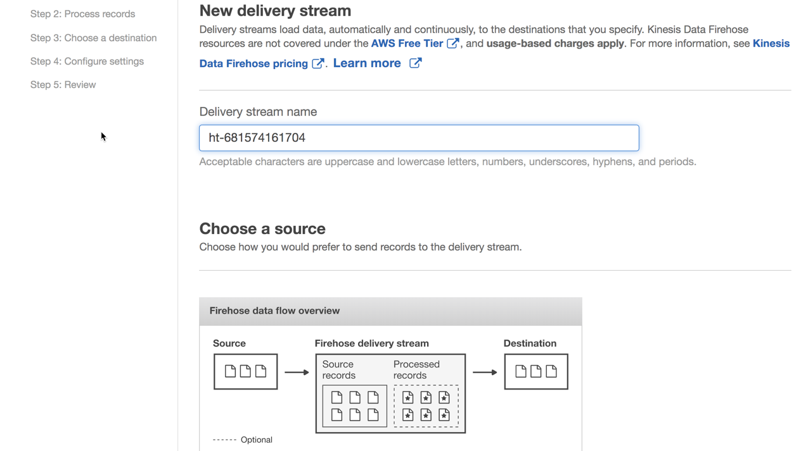
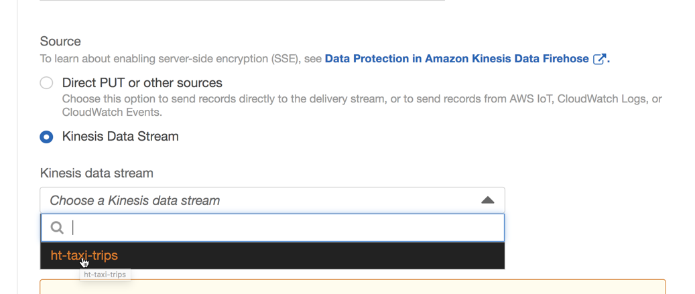
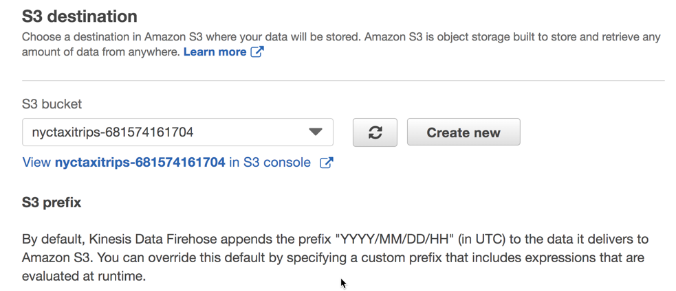
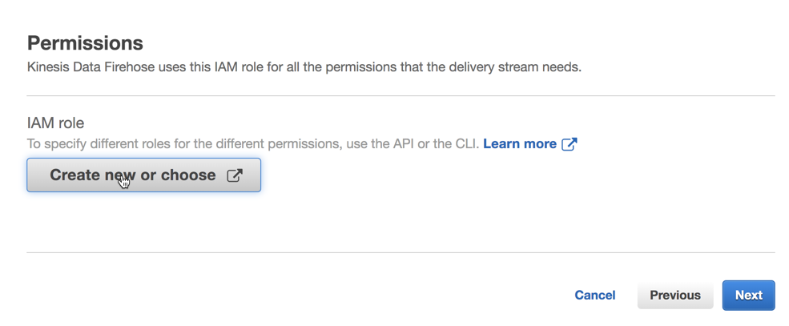
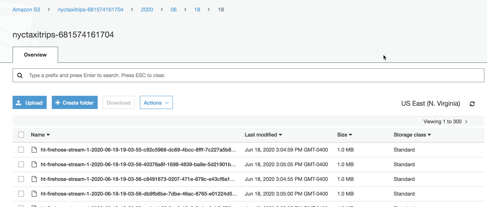

# Immersion Day Lab 2 - Deliver stream data usinf Kinesis Data Firehose

## Configure Kinesis firehose to subscribe to Kinesis Stream as a consumer.

1. Lets first create an S3 bucket which you want Firehose to send data to. 
Navigate to S3 --> Create bucket --> Name the bucket using your "initials-accoutnumber" as seen in screenshot below. Your AWS acct number can be found at the top right section of the browser window. Click Create



2. Once you have the bucket created, lets navigate to Kinesis-->Delivery Streams (left hand pane) --> Click on "Create Delivery Stream". That should open the configuration page as seen below. 



3. Select the Kinesis source as per screenshot below.



4. Click Next --> Next and Select S3 destination as seen in screenshot below.



5. Click Next (Leave rest default). Scroll down to Permission and click the button as in screenshot below 



6. It should open a new window for IAM. Click allow and then click next

Review your changes and click "Create Delivery Stream". Now, your firehose will start writing to S3 bucket with the default prefix of year/month/date/hour/file format as seen in screenshot below



7. Now that your data is in S3, you can create an athena table on top of it and start querying!.

## Optional exercise.
### Create the external table that Kinesis Data Firehose will use as a schema for data format conversion

* Go to the Athena console, in the left pane, under "Database", click on the dropdown and select the default database. Remember to replace the S3 bucket name with the name of the bucket you created earlier through the S3 console.

```
/* BE SURE TO EDIT THE BUCKET PART OF THE LOCATION (LAST LINE) WITH THE NAME OF YOUR S3 BUCKET */

CREATE EXTERNAL TABLE `nyctaxitrips`(
  `pickup_latitude` double, 
  `pickup_longitude` double, 
  `dropoff_latitude` double, 
  `dropoff_longitude` double, 
  `trip_id` bigint, 
  `trip_distance` double, 
  `passenger_count` int, 
  `pickup_datetime` timestamp, 
  `dropoff_datetime` timestamp, 
  `total_amount` double)
 PARTITIONED BY ( 
  `year` string, 
  `month` string, 
  `day` string, 
  `hour` string)
 ROW FORMAT SERDE 
  'org.apache.hadoop.hive.ql.io.parquet.serde.ParquetHiveSerDe' 
 STORED AS INPUTFORMAT 
  'org.apache.hadoop.hive.ql.io.parquet.MapredParquetInputFormat' 
 OUTPUTFORMAT 
  'org.apache.hadoop.hive.ql.io.parquet.MapredParquetOutputFormat'
 LOCATION
  's3://nyctaxitrips-acctnumber

```

## Congratulations- You have finished this Lab.


