# Immersion Day Lab 2 - Clean, Aggregate, and Enrich Events with Kinesis Data Analytics SQL.

In this section, we create an Amazon Kinesis Data Stream as a pre-requisite to using Kinesis Data Analytics steam and populate the stream running a producer client program on an EC2 instance that streams a data set of taxi trips made in NYC.

The source code of the java replay program is available [here](https://github.com/aws-samples/amazon-kinesis-replay). We will then use this producer code to stream NYC taxi trips data.

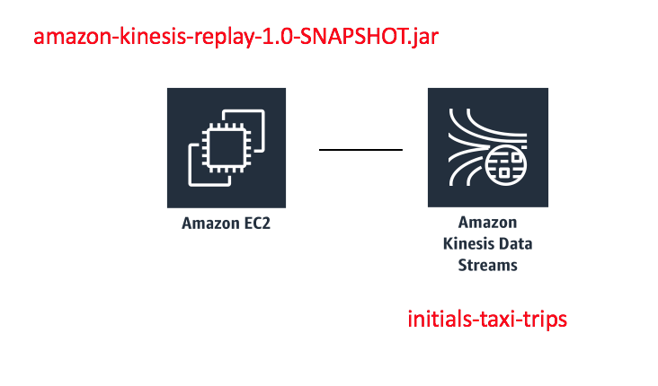

## Pre-Requisite: Create the Kinesis Data Stream
###  1.	Using the AWS Console, navigate to the Amazon Kinesis services and press Get Started when prompted (you may not need to complete this, if you have already used Amazon Kinesis). Select Create data stream to navigate to the Amazon Kinesis Data Stream service. 

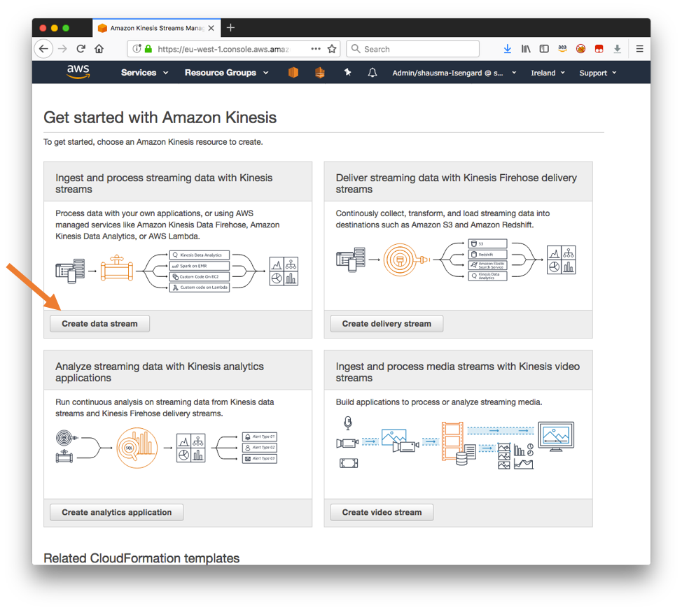

### 2.	When prompted, enter a unique name for the Kinesis data stream, eg, initials-taxi-trips, as Kinesis stream name. Enter 6 as the Number of shards and select Create Kinesis stream at the bottom of the page. 

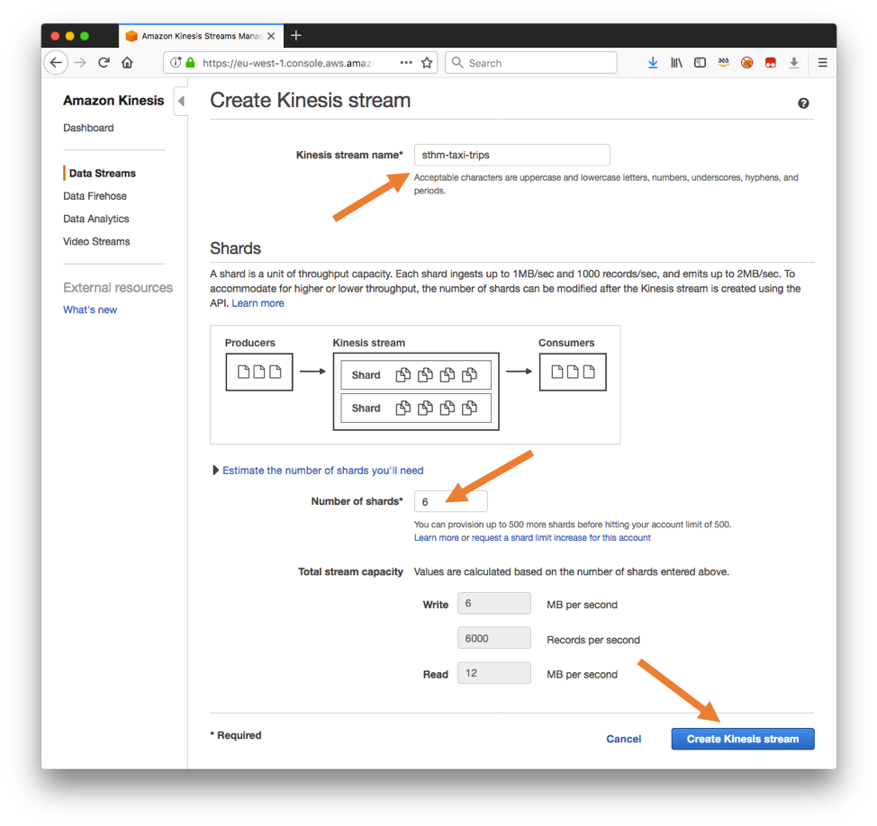

Now that the Kinesis data stream has been created, we want to ingest historic taxi trip events into the data stream. To this end, we will launch a CloudFormation template that compiles a kinesis replay Java application and loads it onto an EC2 instance.  First, we will need to have an EC2 SSH Key Pair as the CloudFormation template will need that

## Create an EC2 SSH Key Pair
In this section, you will define your personal SSH Key Pair private key so you can login to the EC2 instance we will use in this lab.

### 1.	Navigate to the EC2 service and choose Key Pairs in the navigation bar on the left. 

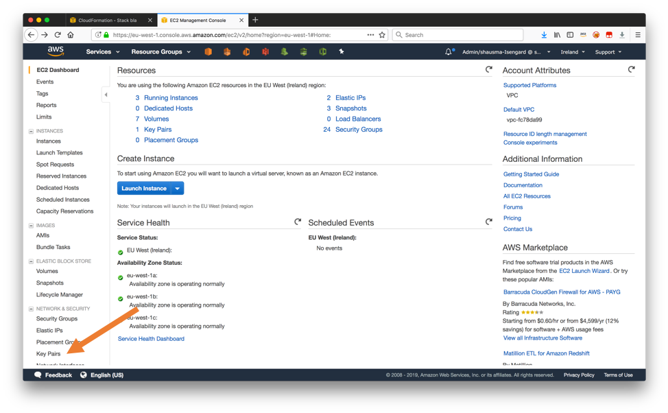

### 2.	Click Create Key Pair and enter a name for the SSH key pair in the resulting dialog box, eg, initals-key-pair and select Create. 

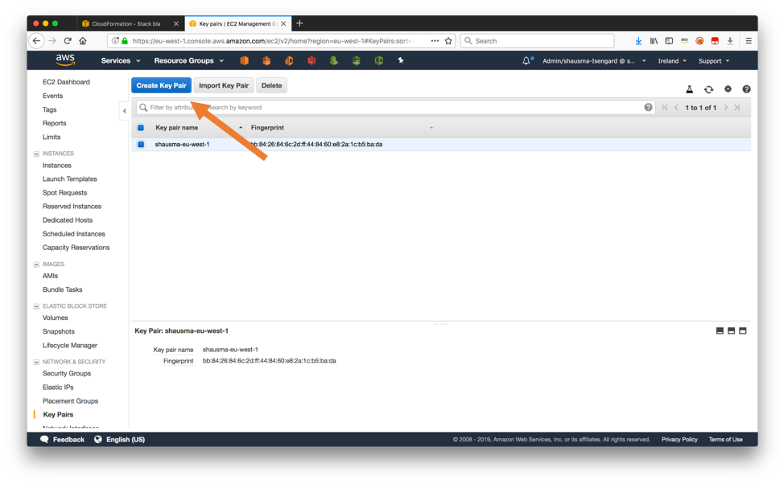

### 3.	Confirm the download of the generated .pem file to your local machine.

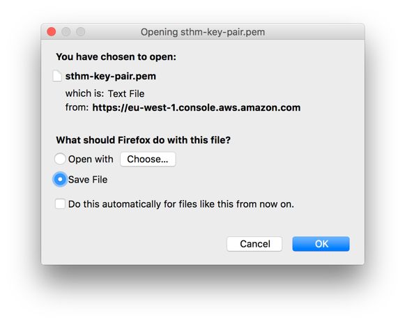

Now that you have successfully created an SSH key pair, you can create the EC2 instance that you will use to ingest taxi trip events into the previously created Kinesis data stream.

## Create an EC2 Instance and Build the taxi trip producer client
In this section, you will use a CloudFormation template to build a producer client program that sends NYC taxi trip data to our Kinesis Data Stream.


### 1.	Right-click on this [link](https://console.aws.amazon.com/cloudformation/home#/stacks/new?stackName=kinesis-replay-infrastructure&templateURL=https://dave-kinesis-lab.s3.amazonaws.com/kinesis-replay-infrastructure.yml) and open it in a new tab to execute a CloudFormation template that uses CodePipeline and CodeBuild to compile the kinesis replay Java application and to provision a EC2 instance. Select Next on the resulting dialog. 

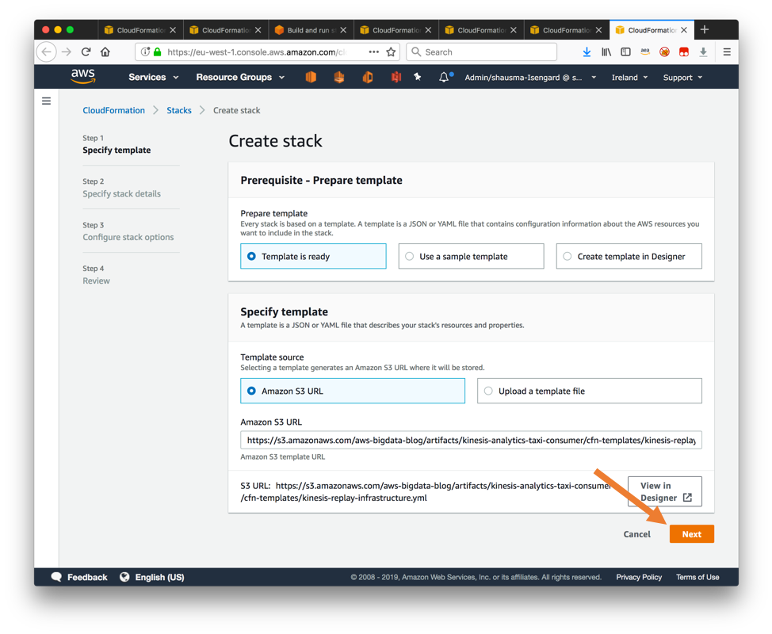

### 2.	On the next page of the dialog, specify an appropriate CIDR range to that is able to connect to the EC2 instance over SSH as the ClientIpAddressRange parameter. Moreover, select the previously created SSH key pair from the SshKeyName dropdown menu.

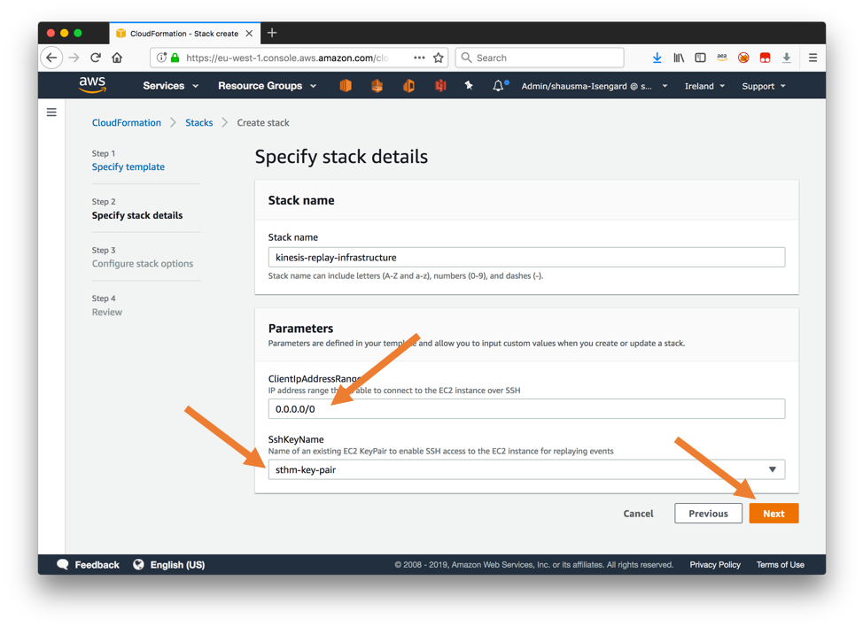

### 3.	On the next dialog for Step 3, leave all parameters set to their default and select Next. 

### 4.	On the last page of the dialog, confirm that CloudFormation may create IAM resource and create nested CloudFormation stacks by selecting the checkbox "I acknowledge that AWS CloudFormation might create IAM resources" and "I acknowledge that AWS CloudFormation might require the following capability: CAPABILITY_AUTO_EXPAND". Finally select Create stack at the bottom of the page.

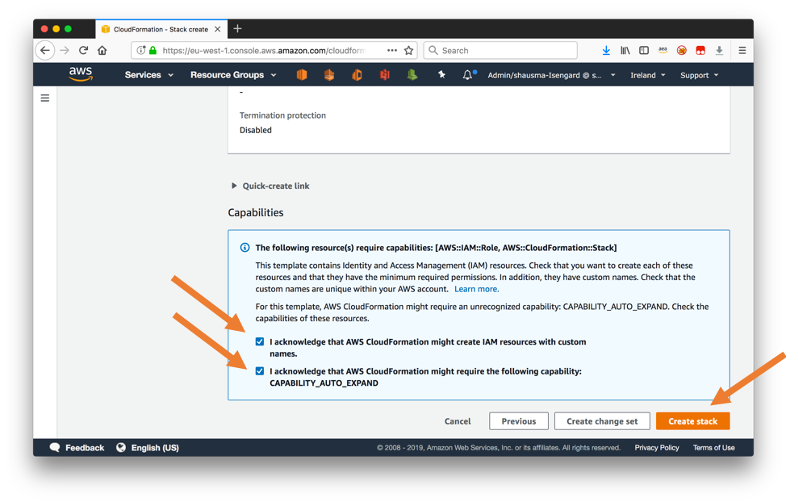

### 5.	Wait until the CloudFormation template has been successfully been created. This may take around 5 minutes.

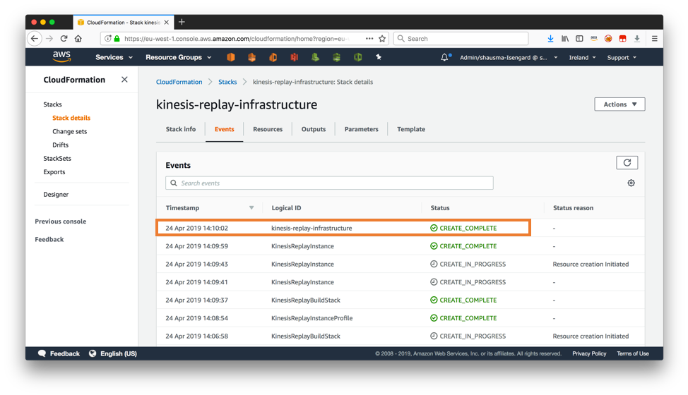

### 6.	Navigate to the Outputs section of the CloudFormation template and take a note of the outputs for KinesisReplayInstance and ProducerCommand.

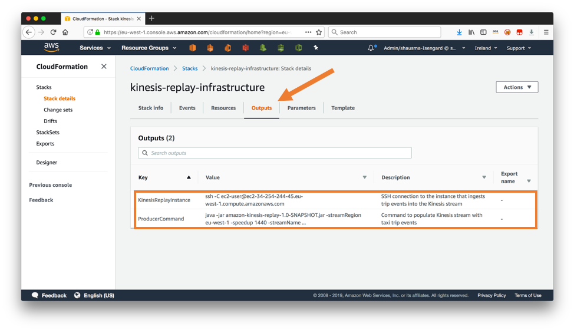

The CloudFormation template has created and configured an EC2 instance so that we can now start to ingest taxi trip events into the Kinesis data stream.


## Connect to the new EC2 instance and run the producer client program
In this section, you will connect to the new EC2 instance and launch the compiled java producer program.

### 1.	Connect to the EC2 instance via SSH from your laptop. You can obtain the command including the correct parameters from the Outputs section of the CloudFromation template.  

Note: you will need to edit the "keyname.pem" and point to your downloaded ec2 ssh keypair file (your filename probably will be different than keyname.pem).
Note: you will likely also need to do a "chmod 0400 keyname.pem" on your ssh keypair file to set the right permissions.

Use the command from the Outputs section, but it should look somewhat like this:
```
# DO NOT COPY AND PASTE THIS COMMAND.
# THIS IS JUST AN EXAMPLE
# USE THE OUTPUT FROM YOUR CLOUDFORMATION TEMPLATE.
# YOU WILL NEED TO EDIT THE keyname.pem file/location.
$ chmod 0400 keyname.pem
$ ssh -i keyname.pem -C ec2-user@ec2-34-254-244-45.us-east-1.compute.amazonaws.com
```
 
Note for Windows users: Instead of the above command, you will need to follow these [instructions](https://docs.aws.amazon.com/AWSEC2/latest/UserGuide/putty.html) to use PuTTY to connect to the EC2 instance.


### 2.	Once the connection has been established, start ingesting events into the Kinesis data stream by executing the jar file that has already been downloaded to the Ec2 instance.  You will need to fill in the name of Kinesis data stream you have created earlier as the streamName parameter.

Use the command from the Outputs section, but it should look somewhat like this:
```
# DO NOT COPY AND PASTE THIS COMMAND.
# THIS IS JUST AN EXAMPLE
# USE THE OUTPUT FROM YOUR CLOUDFORMATION TEMPLATE.
# AND YOU WILL NEED TO MODIFY THE intials PART OF initials-taxi-trip
$ java -jar amazon-kinesis-replay-1.0-SNAPSHOT.jar -streamRegion us-east-1 -speedup 1800 -streamName initials-taxi-trips
```

Note: The almost correct command is again available from the Outputs section of the CloudFormation template, but this time you need to replace initials-taxi-trips in the streamName parameter with the name of Kinesis data stream you have created earlier.

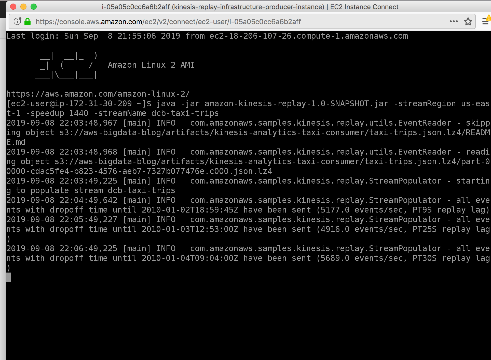

* Navigate to the Kinesis console and click on "initials-taxi-trips" in the Kinesis Data Streams section.

* Click on the Monitoring tab and scroll down to view the "Incoming Data (Bytes) - Sum" metric.  You may need to wait 2 or 3 minutes as well as use the refresh button for the monitoring charts to see metrics. 

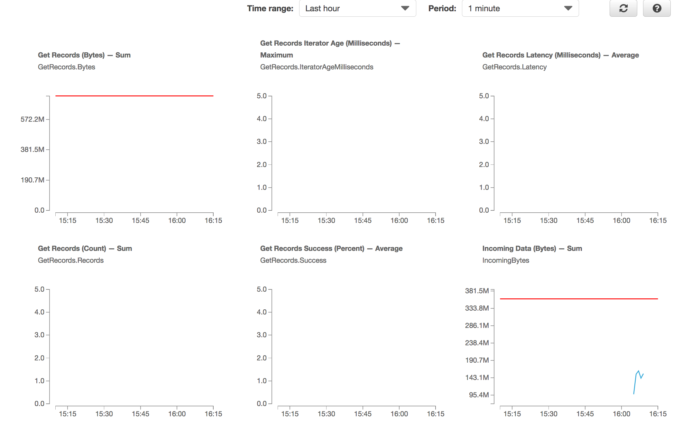


If we review what you have done, you have created an EC2 environment that can run our Java taxi trip replay producer.  Then you have connected to the EC2 instance and started the replay program.  The speedup parameter of 1800 tells our replay program to replay the taxi trips 1800x faster, which is essentially to replay 30 minutes of taxi trips every second.

## You have completed the pre-requisites for this lab!! Lets move on to Kinesis Data Analytics

# Kinesis Immersion Day Lab3 - Clean, Aggregate, and Enrich Events with Kinesis Data Analytics SQL

In the previous section, you’ve created a Kinesis data stream and started to ingest events into the data stream. In this section, you will learn how to connect Kinesis Data Analytics to your existing stream and clean, aggregate, and enrich the incoming events.


### 1.	Navigate to the Amazon Kinesis services and select Create analytics application to navigate to the Amazon Kinesis Data Stream service.


### 2.	Enter a name for the application as Application name, eg, initials-taxi-trips. Select SQL as the Runtime and hit the Create application button.


### 3.	Select Connect streaming data to connect the existing Kinesis data stream with your Kinesis Analytics application.


### 4.  Select Kinesis stream as the Source and choose the Kinesis data stream you have created earlier from the Kinesis stream dropdown menu.


### 5.	Ensure that the replay Java application is still ingesting events into the Kinesis data stream and select Discover schema at the bottom of the same page.


### 6.	After the schema discovery completed successfully, select Edit schema to fine tune the inferred schema.


### 7.	In the dropdown menu for the type of the attribute trip_id, change the type from INT to BIGINT. Moreover, change the Length of the attribute type from 4 to 9. Complete this step by pressing Save schema and update stream samples. It may take a minute until the operation completes.

Note: If the type of trip_id is already BIGINT, then you can leave it as it is. If the length of the type attribute is already >=9, then you can leave the length as it is.


### 8.	Verify, that the incoming events are successfully mapped to the corrected schema and click on Exit (done). 


### 9.	Back in the configuration dialog of your Kinesis Analytics application, select Go to SQL editor.


### 10.	Replace the existing code in the editor window with the following SQL code.

```
CREATE OR REPLACE STREAM cleaned_trips (
    pickup_latitude     DOUBLE,    
    pickup_longitude    DOUBLE,    
    dropoff_latitude    DOUBLE,    
    dropoff_longitude   DOUBLE,
    trip_id             BIGINT,
    trip_distance       REAL,
    passenger_count     INTEGER,
    pickup_datetime     TIMESTAMP,
    dropoff_datetime    TIMESTAMP,
    total_amount        REAL
);

CREATE OR REPLACE PUMP clean_pump AS 
    INSERT INTO cleaned_trips
        SELECT STREAM
            "pickup_latitude", 
            "pickup_longitude", 
            "dropoff_latitude", 
            "dropoff_longitude", 
            "trip_id", 
            "trip_distance", 
            "passenger_count", 
            "pickup_datetime",
            "dropoff_datetime",
            "total_amount"
        FROM source_sql_stream_001
        WHERE "type" LIKE 'trip' AND ("pickup_latitude" <> 0 AND "pickup_longitude" <> 0 AND "dropoff_latitude" <> 0 AND "dropoff_longitude" <> 0);


CREATE OR REPLACE STREAM trip_statistics (
    trip_count          INTEGER,
    passenger_count     INTEGER,
    total_amount        REAL
);

CREATE OR REPLACE PUMP statistics_pump AS 
    INSERT INTO trip_statistics
        SELECT STREAM
            COUNT(1) as trip_count, 
            SUM(passenger_count) as passenger_count, 
            SUM(total_amount) as total_amount
        FROM cleaned_trips
        GROUP BY STEP(cleaned_trips.ROWTIME BY INTERVAL '2' SECOND)
        ORDER BY STEP(cleaned_trips.ROWTIME BY INTERVAL '2' SECOND);

```

### 11.	Select Save and run to start the execution of the SQL code.

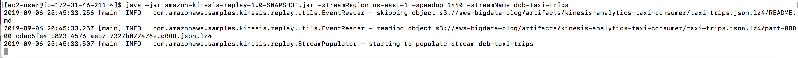

### 12.	At the bottom of the page, select TRIP_STATISTICS to observe the output of the queries in real time.


To review what we've done so far, we have defined two Streams and two Pumps.  A Stream is like an in-memory table.  A Pump is like a continuous query that is used to populate our stream.

Our first stream is called "cleaned_trips" which is populated by our "clean_pump" pump which selects only those records of the type='trip' that have valid longitude and latitudes.

Our second stream is called "trip_statistics" which is populated by our "statistics_pump" pump.  The "statistics_pump" pump calculates summary statistics for every 2 second interval.


### 13.	Extend the existing program by append the following code to the bottom of the existing SQL.

```
CREATE OR REPLACE STREAM trip_statistics_anomaly_tmp (
    trip_count          INTEGER,
    passenger_count     INTEGER,
    total_amount        REAL,
    anomaly_score       DOUBLE,
    anomaly_explanation VARCHAR(20480),
    resolution          VARCHAR(8)
);

CREATE OR REPLACE STREAM trip_statistics_anomaly (
    rowtime_ts          TIMESTAMP,
    trip_count          INTEGER,
    passenger_count     INTEGER,
    total_amount        REAL,
    anomaly_score       DOUBLE,
    anomaly_explanation VARCHAR(20480),
    resolution          VARCHAR(8)
);


CREATE OR REPLACE PUMP trip_statistics_anomaly_pump AS 
    INSERT INTO trip_statistics_anomaly
        SELECT STREAM FLOOR(trip_statistics_anomaly_tmp.ROWTIME TO SECOND) AS rowtime_ts, trip_count, passenger_count, total_amount, anomaly_score, anomaly_explanation, resolution
        FROM trip_statistics_anomaly_tmp
        ORDER BY FLOOR(trip_statistics_anomaly_tmp.ROWTIME TO SECOND), ANOMALY_SCORE DESC;

CREATE OR REPLACE PUMP trip_statistics_anomaly_60min_pump AS 
    INSERT INTO trip_statistics_anomaly_tmp
        SELECT STREAM trip_count, passenger_count, total_amount, anomaly_score, anomaly_explanation, '60min'
        FROM TABLE(RANDOM_CUT_FOREST_WITH_EXPLANATION(
            CURSOR(SELECT STREAM trip_count, passenger_count, total_amount FROM trip_statistics),
            100, 256, 100000, 24, false));

```

### 14.	Click Save and run SQL to execute the updated program.


### 15.	Select TRIP_STATISTICS_ANOMALY as In-application streams.


The (random cut forest algorithm)[https://docs.aws.amazon.com/kinesisanalytics/latest/sqlref/sqlrf-random-cut-forest-with-explanation.html] takes a couple of minutes to initialize (during which the ANOMALY_SCORE will be zero). Once the initialization phase has completed, you should see a meaningful ANOMALY_SCORE value and ANOMALY_SCORE_EXPLANATION. 

## Congratulations.  You have successfully completed Lab2 - Clean, Aggregate, and Enrich Events with Kinesis Data Analytics SQL.


